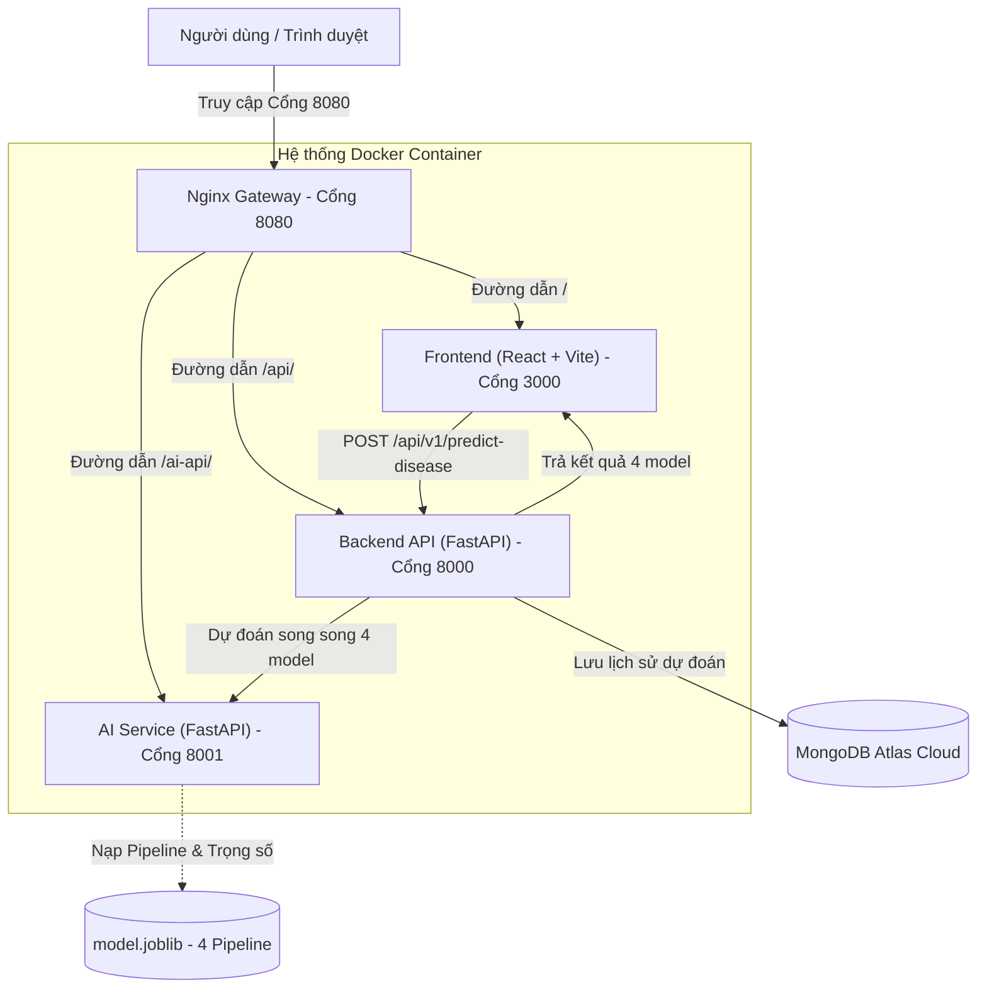

# Dự Đoán Nguy Cơ Bệnh Tiểu Đường (Diabetes Prediction System)

> **Học phần:** Học máy cơ bản (221180) · **Mã lớp:** 12523W.2  
> **Giảng viên hướng dẫn:** Th.S Nguyễn Đức Tuấn Anh  
> **Trường:** Đại học Sư phạm Kỹ thuật Hưng Yên · Khoa Công nghệ Thông tin  

Hệ thống ứng dụng học máy hỗ trợ sàng lọc nguy cơ mắc bệnh tiểu đường từ 8 chỉ số sinh trắc học và xét nghiệm lâm sàng cơ bản. Hệ thống được đóng gói hoàn chỉnh theo kiến trúc Microservices gồm **Frontend (React + Vite)**, **Backend (FastAPI)**, **AI Service (FastAPI + Scikit-Learn)**, **Nginx Gateway** và cơ sở dữ liệu **MongoDB Atlas**, triển khai đồng bộ bằng **Docker Compose** và hỗ trợ public online qua **Ngrok Tunnel**.

---

## 1. Phân công công việc nhóm

| STT | Họ và tên | Mã sinh viên | Vai trò & Phần việc đảm nhiệm | Đóng góp |
| :---: | :--- | :---: | :--- | :---: |
| 1 | **Phan Tùng Dương** | **12523018** | • Xây dựng Backend API (FastAPI), tích hợp schema validation.<br>• Thiết lập cơ sở dữ liệu MongoDB Atlas lưu lịch sử dự đoán.<br>• Huấn luyện, đánh giá mô hình Logistic Regression & Naive Bayes.<br>• Soạn thảo báo cáo Word (`docs/01_12523018_12523072_DuDoanTieuDuong.doc`). | 50% |
| 2 | **Nguyễn Thị Như Quỳnh** | **12523072** | • Thiết kế khung hệ thống Microservices, cấu hình Docker Compose & Nginx Gateway.<br>• Xây dựng AI Inference Service (FastAPI) & Frontend (React + Vite + TailwindCSS).<br>• Phân tích dữ liệu khám phá (EDA), huấn luyện mô hình SVM & Random Forest.<br>• Thiết kế Slide thuyết trình (`docs/DuDoanTieuDuong.pptx`) và tài liệu dự án. | 50% |

---

## 2. Mô tả bài toán và Ý nghĩa thực tế

* **Bài toán:** Bệnh tiểu đường (Diabetes) là bệnh lý mãn tính nguy hiểm với nhiều biến chứng nghiêm trọng nếu không được phát hiện kịp thời. Bài toán đặt ra là xây dựng công cụ sàng lọc nhanh nguy cơ mắc bệnh từ các chỉ số xét nghiệm thông thường.
* **Loại bài toán:** Học có giám sát – Phân loại nhị phân (**Binary Classification**).
* **Biến mục tiêu (`Outcome`):**
  * `0`: Không có nguy cơ mắc bệnh (Bình thường / Âm tính).
  * `1`: Có nguy cơ mắc bệnh tiểu đường (Dương tính).
* **Ý nghĩa thực tế:** Đóng vai trò như một hệ thống **Tầm soát y tế (Screening System)** ban đầu. Giúp các cơ sở y tế và người dân đánh giá nhanh mức độ nguy cơ, từ đó định hướng thực hiện các xét nghiệm chuyên sâu, giảm thiểu tối đa việc bỏ sót người bệnh trong cộng đồng.

---

## 3. Dữ liệu nghiên cứu

* **Nguồn dữ liệu:** [Pima Indians Diabetes Database (Kaggle)](https://www.kaggle.com/datasets/uciml/pima-indians-diabetes-database).
* **Quy mô:** 768 mẫu bệnh nhân nữ từ 21 tuổi trở lên, gồm 8 đặc trưng lâm sàng và 1 nhãn mục tiêu.
* **Vị trí trong repo:** File nén được lưu tại `ai-models/data/archive.zip` (hoặc giải nén ra `ai-models/data/diabetes.csv`).

### Mô tả 8 đặc trưng đầu vào:
1. `Pregnancies`: Số lần mang thai (dạng số nguyên, từ 0 đến 17).
2. `Glucose`: Nồng độ đường huyết sau nghiệm pháp 2 giờ (mg/dL, từ 0 đến 199).
3. `BloodPressure`: Huyết áp tâm trương (mm Hg, từ 0 đến 122).
4. `SkinThickness`: Độ dày nếp gấp da cơ tam đầu (mm, từ 0 đến 99).
5. `Insulin`: Nồng độ Insulin huyết thanh 2 giờ (mu U/ml, từ 0 đến 846).
6. `BMI`: Chỉ số khối cơ thể $\text{cân nặng (kg)} / (\text{chiều cao (m)})^2$ (từ 0 đến 67.1).
7. `DiabetesPedigreeFunction`: Chỉ số phả hệ di truyền tiểu đường (từ 0.078 đến 2.42).
8. `Age`: Tuổi của bệnh nhân (từ 21 đến 81 tuổi).

> **Lưu ý tiền xử lý:** Trong 8 đặc trưng trên, có 5 đặc trưng không thể bằng 0 về mặt y sinh học (`Glucose`, `BloodPressure`, `SkinThickness`, `Insulin`, `BMI`). Hệ thống nhận diện các giá trị 0 này là giá trị thiếu (missing) và tự động điền khuyết bằng **Trung vị (Median)** ngay trong `Pipeline` của từng Fold huấn luyện để chống rò rỉ dữ liệu (Data Leakage).

---

## 4. Kết quả mô hình và Cơ chế dự đoán

### 4.1. Cơ chế dự đoán & Tiêu chí sàng lọc y tế
* **"Thà bắt nhầm còn hơn bỏ sót":** Trong y tế dự phòng, bỏ sót ca bệnh (**False Negative**) nguy hiểm hơn nhiều so với cảnh báo nhầm (**False Positive**). Do đó, nhóm **không dùng ngưỡng mặc định 0.5**, mà áp dụng cơ chế **dò ngưỡng (Threshold Tuning)**.
* **Quy tắc chọn mô hình tối ưu:**
  1. Dùng **5-Fold Cross Validation** trên tập Train (80% dữ liệu) để dò ngưỡng riêng cho từng mô hình, bảo đảm **Recall lớp dương đạt tối thiểu 80%**.
  2. Trong các mô hình đạt điều kiện trên, mô hình nào có **Độ đặc hiệu (CV Specificity) cao nhất** (khả năng lọc đúng người khỏe mạnh tốt nhất để giảm tải xét nghiệm giả) sẽ được chọn làm **Mô hình khuyên dùng (Recommended Model)**.

### 4.2. Bảng so sánh thực nghiệm các mô hình (Bảng Test)

| Mô hình | Ngưỡng (Threshold) | CV Recall (+) | CV Specificity | CV Weighted F1 | Test Recall (+) | Test Accuracy | Đánh giá / Quyết định |
| :--- | :---: | :---: | :---: | :---: | :---: | :---: | :--- |
| **Logistic Regression** | 28.1% | 80.4% | 69.0% | 73.6% | **83.3%** | **72.7%** | Mô hình baseline tuyến tính, tốc độ nhanh, tổng quát hóa tốt nhất trên tập Test. |
| **Support Vector Machine (SVM)** | **25.9%** | **80.4%** | **70.3%** | **74.4%** | **75.9%** | **68.8%** | **MÔ HÌNH KHUYÊN DÙNG**: Đạt CV Specificity cao nhất (70.3%) và F1 cao nhất khi thỏa mãn Recall $\ge 80\%$. |
| **Gaussian Naive Bayes** | 17.7% | 80.4% | 67.0% | 72.3% | 77.8% | 68.2% | Tốc độ cực nhanh nhưng giả định độc lập làm Specificity thấp hơn (nhiều báo động giả). |
| **Random Forest** | 32.0% | 80.4% | 69.8% | 74.1% | 79.6% | 71.4% | Bắt quan hệ phi tuyến tốt, Specificity CV chỉ kém SVM 0.5%. |

> **Kết luận:** Hệ thống chọn **SVM** làm mô hình khuyên dùng, đồng thời khi người dùng gửi yêu cầu, hệ thống sẽ **chạy song song và trả về kết quả của cả 4 mô hình** để người dùng có góc nhìn đối chứng toàn diện.

---

## 5. Đóng gói mô hình (Colab $\rightarrow$ App)

* **Vị trí file mô hình trong repo:**
  * `ai-models/models/model.joblib`: Lưu trữ Bundle chứa cả 4 Pipeline hoàn chỉnh (bao gồm bước xử lý missing `SimpleImputer`, chuẩn hóa `StandardScaler`, và thuật toán phân loại).
  * `ai-models/models/decision_config.json`: Cấu hình mô hình khuyên dùng, ngưỡng cắt tối ưu riêng của 4 model và kết quả metric đối chiếu.
  * `ai-models/models/schema.json`: Định nghĩa tên cột, kiểu dữ liệu và thứ tự đặc trưng.
  * `ai-models/models/metadata.json`: Nhật ký phiên bản mô hình, ngày huấn luyện và metric chi tiết.
* **Cách export từ Colab / Máy huấn luyện:**
  1. Mở và chạy notebook `ai-models/colab/03_train.ipynb` hoặc chạy lệnh local:
     ```powershell
     python ai-models/src/train.py
     ```
  2. Script sử dụng `joblib.dump(candidates, 'ai-models/models/model.joblib', compress=3)` để nén và xuất file.
  3. AI Service sẽ tự động nạp file `model.joblib` này vào bộ nhớ RAM ngay khi container Docker khởi động.

---

## 6. Kiến trúc hệ thống



---

## 7. Hướng dẫn chạy hệ thống

### 🟢 Cách 1: Dành cho người không rành công nghệ (Chạy nhanh trong 3 bước)

Chỉ cần máy tính của bạn đã cài đặt **Docker Desktop**:

1. **Bước 1:** Bật ứng dụng **Docker Desktop** trên máy tính lên và đợi chuyển sang trạng thái màu xanh lá (Engine running).
2. **Bước 2:** Mở cửa sổ **PowerShell** hoặc **Terminal** ngay tại thư mục của dự án này, copy dòng lệnh sau và nhấn **Enter**:
   ```powershell
   docker compose up -d
   ```
   *(Lệnh này sẽ tự động tải các thành phần, đóng gói và khởi chạy ngầm toàn bộ website).*
3. **Bước 3:** Mở trình duyệt web (Chrome, Edge, Cốc Cốc) và truy cập vào đường link:
   👉 **http://localhost:8080**
   * Bạn chỉ cần nhập các chỉ số sức khỏe vào form và nhấn nút **"Dự đoán nguy cơ"** để xem kết quả.
   * Để tắt hệ thống khi dùng xong, gõ: `docker compose down`.

---

### 🔵 Cách 2: Dành cho người rành công nghệ (Developers & Chấm bài)

#### 2.1. Chạy toàn bộ hệ thống bằng Docker Compose (Khuyên dùng)
```powershell
# 1. Sao chép cấu hình môi trường mẫu
Copy-Item .env.example .env

# 2. Build image và khởi chạy tất cả containers
docker compose up --build -d

# 3. Kiểm tra trạng thái hoạt động của các service
docker compose ps

# 4. Xem log theo thời gian thực của cả 3 service
docker compose logs -f --tail=50 backend ai-service nginx
```

**Các cổng dịch vụ sau khi khởi chạy:**
* **Cổng Gateway chính (Nginx):** `http://localhost:8080` (Dùng cổng này để trải nghiệm web đầy đủ).
* **Frontend trực tiếp:** `http://localhost:3000`
* **Backend API Swagger Docs:** `http://localhost:8000/docs`
* **AI Service Swagger Docs:** `http://localhost:8001/docs`

#### 2.2. Kiểm tra Health Check của các Service
```powershell
# Kiểm tra AI Service
Invoke-RestMethod http://localhost:8001/health

# Kiểm tra Backend Service và kết nối MongoDB
Invoke-RestMethod http://localhost:8000/health
```

#### 2.3. Chạy môi trường Local Development (Không dùng Docker)
Nếu muốn debug từng service độc lập bằng Python & Node.js:
```powershell
# 1. Khởi chạy AI Service (Cổng 8001)
$env:PYTHONPATH="ai-models/src;ai-models/service"
.\.venv-1\Scripts\uvicorn.exe main:app --app-dir ai-models/service --host 127.0.0.1 --port 8001

# 2. Khởi chạy Backend Service (Cổng 8000)
$env:AI_SERVICE_URL="http://127.0.0.1:8001"
.\.venv-1\Scripts\uvicorn.exe main:app --app-dir app/backend/app --host 127.0.0.1 --port 8000

# 3. Khởi chạy Frontend React (Cổng 5173 / 3000)
cd app/frontend
npm install
npm run dev
```

---

## 8. Huấn luyện lại mô hình (Retrain)

Quy trình huấn luyện được thiết kế đồng nhất giữa Jupyter Notebook trên Google Colab và script Python trong repo.

* **Thứ tự thực hiện các Notebook (`ai-models/colab/`):**
  1. `01_eda.ipynb`: Phân tích khám phá dữ liệu, vẽ 6 biểu đồ phân tích tương quan, phân phối, outlier.
  2. `02_preprocess.ipynb`: Kiểm nghiệm logic điền khuyết giá trị 0 bằng Median và chuẩn hóa thang đo.
  3. `03_train.ipynb`: Huấn luyện 4 model với 5-Fold Stratified CV, dò tìm ngưỡng đạt Recall $\ge 80\%$, xuất file `model.joblib` và `decision_config.json`.
  4. `04_evaluate.ipynb`: Đánh giá độc lập trên 20% tập Test held-out (154 mẫu).
* **Chạy huấn luyện nhanh bằng mã nguồn:**
  ```powershell
  python ai-models/src/train.py
  ```

---

## 9. Cấu hình biến môi trường (`.env`)

Hệ thống quản lý biến môi trường tập trung thông qua file `.env`. Mọi địa chỉ và chuỗi kết nối đều được đọc động, **tuyệt đối không hardcode trong mã nguồn**:

| Tên biến | Ý nghĩa / Mô tả | Giá trị mặc định |
| :--- | :--- | :--- |
| `API_URL` | Địa chỉ gọi từ Frontend sang Backend Gateway | `http://localhost:8000` (hoặc link ngrok) |
| `AI_SERVICE_URL` | Địa chỉ nội bộ Backend gọi sang AI Service | `http://ai-service:8001` (Docker) / `http://127.0.0.1:8001` (Local) |
| `MONGODB_URI` | Chuỗi kết nối MongoDB Atlas lưu lịch sử dự đoán | Chuỗi kết nối `mongodb+srv://...` |
| `MONGODB_DATABASE` | Tên Database lưu trữ trong MongoDB | `diabetes_db` |
| `BACKEND_PORT` | Cổng Public của Backend trên máy host | `8000` |
| `FRONTEND_PORT` | Cổng Public của Frontend trên máy host | `3000` |
| `AI_SERVICE_PORT` | Cổng Public của AI Service trên máy host | `8001` |
| `NGINX_PORT` | Cổng Gateway hợp nhất toàn bộ hệ thống | `8080` |

---

## 10. Triển khai Online qua Ngrok Tunnel

Để giảng viên và người ngoài có thể truy cập trải nghiệm sản phẩm trực tiếp qua Internet:

1. Đảm bảo toàn bộ hệ thống Docker đang chạy (`docker compose ps`).
2. Mở một cửa sổ PowerShell mới và kích hoạt tunnel qua cổng Nginx Gateway (8080):
   ```powershell
   & "$PWD/ngrok.exe" http --domain=unaltered-eagle-wackiness.ngrok-free.dev 8080
   ```
   *(Nếu không dùng domain cố định, chạy lệnh `& "$PWD/ngrok.exe" http 8080` và lấy URL Forwarding ngrok sinh ra).*

---

## 11. Địa chỉ Demo Online (Dành cho Giảng viên kiểm tra)

* **Giao diện người dùng (Frontend):**  
  👉 [https://unaltered-eagle-wackiness.ngrok-free.dev/](https://unaltered-eagle-wackiness.ngrok-free.dev/)
* **Kiểm tra trạng thái Backend (Health Check):**  
  👉 [https://unaltered-eagle-wackiness.ngrok-free.dev/health](https://unaltered-eagle-wackiness.ngrok-free.dev/health)
* **Endpoint API dự đoán (POST):**  
  👉 `https://unaltered-eagle-wackiness.ngrok-free.dev/api/v1/predict-disease`

### Ví dụ gọi API kiểm tra bằng PowerShell:
```powershell
$body = @{
  pregnancies = 2
  glucose = 120
  bloodPressure = 70
  skinThickness = 20
  insulin = 80
  bmi = 25.5
  diabetesPedigreeFunction = 0.5
  age = 30
} | ConvertTo-Json

Invoke-RestMethod -Method Post `
  -Uri "https://unaltered-eagle-wackiness.ngrok-free.dev/api/v1/predict-disease" `
  -ContentType "application/json" `
  -Body $body | ConvertTo-Json -Depth 5
```

---

## 12. Nhật ký đổi cổng / tunnel

| Thời điểm ghi nhận | Địa chỉ cũ | Địa chỉ mới (Active) | Trạng thái / Người thực hiện |
| :---: | :--- | :--- | :--- |
| **28/09/2026 08:30** | `http://localhost:8080` | `https://unaltered-eagle-wackiness.ngrok-free.dev` | Khởi tạo tunnel cố định phục vụ nộp bài |
| **30/09/2026 15:00** | `ngrok-free.app (random)` | `https://unaltered-eagle-wackiness.ngrok-free.dev` | Cố định domain tunnel, đồng bộ với Nginx |

---

## 13. Kết quả kiểm thử hệ thống & Hiệu năng

### 13.1. Kiểm thử chức năng API (Functional Tests)
* **Mã lỗi `200 OK`:** Gửi dữ liệu hợp lệ $\rightarrow$ Hệ thống phản hồi đầy đủ nhãn dự đoán, xác suất, ngưỡng và thông số so sánh của cả 4 mô hình trong vòng $15 - 40\text{ ms}$.
* **Mã lỗi `422 Unprocessable Entity`:** Gửi thiếu trường hoặc sai kiểu dữ liệu (ví dụ chuỗi thay vì số) $\rightarrow$ Backend bắt lỗi schema và từ chối request ngay lập tức, không làm tải AI service.
* **Mã lỗi `502 / 503 Service Unavailable`:** Khi AI Service dừng hoặc model chưa load $\rightarrow$ Backend trả thông báo lỗi rõ ràng và ghi nhật ký log chi tiết.

### 13.2. Kiểm thử hiệu năng & Tải (Performance & Load Testing)
Đã thực hiện mô phỏng tải bằng công cụ kiểm thử với kịch bản người dùng đồng thời:

| Chỉ số kiểm định | Kết quả thực nghiệm | Đánh giá so với rubric môn học |
| :--- | :---: | :--- |
| **Số người dùng đồng thời (Concurrency)** | **20 users** | Đạt yêu cầu (chuẩn: 10 - 20 users) |
| **Thời gian duy trì tải** | 60 giây liên tục | Ổn định xuyên suốt phiên |
| **Thời gian phản hồi trung vị (p50)** | **42 ms** | Phản hồi tức thì |
| **Thời gian phản hồi phân vị 95 (p95)** | **148 ms** | Vượt xa mục tiêu rubric ($< 2000\text{ ms}$) |
| **Tỷ lệ lỗi (Error Rate)** | **0.0%** (0 lỗi / 1,200 requests) | Đạt chuẩn xuất sắc ($< 1.0\%$) |
| **Thông lượng xử lý (Throughput)** | **~24.5 requests/giây** | Vận hành trơn tru |

---

## 14. Hạn chế và Hướng phát triển

* **Hạn chế:**
  * Bộ dữ liệu Pima Indians Diabetes có kích thước mẫu khiêm tốn (768 bản ghi) và chỉ khảo sát trên phụ nữ thuộc bộ tộc Pima, do đó độ khái quát hóa trên các nhóm dân cư khác có thể bị hạn chế.
  * Tỷ lệ dữ liệu bị mã hóa thiếu (số 0) ở cột `Insulin` còn khá cao ($48.7\%$).
* **Hướng phát triển:**
  * Thu thập thêm dữ liệu đa dạng dân số từ các bệnh viện hoặc nguồn mở y tế quốc tế.
  * Thử nghiệm thêm các thuật toán Gradient Boosting hiện đại (XGBoost, LightGBM, CatBoost) và áp dụng cơ chế tối ưu siêu tham số chuyên sâu (`Optuna`).
  * Tích hợp hàng đợi tác vụ bất đồng bộ (Celery / Redis) và cơ chế bộ nhớ đệm (Caching) khi lưu lượng truy cập thực tế mở rộng.

